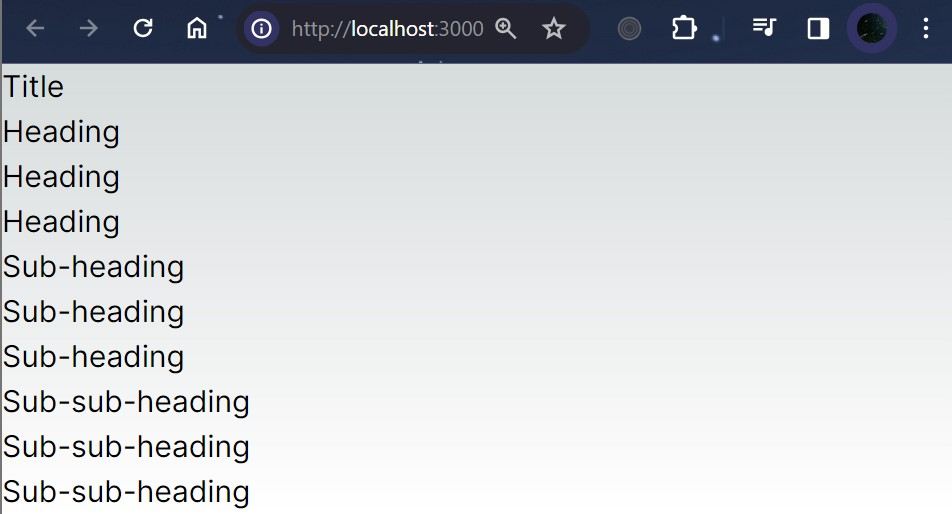
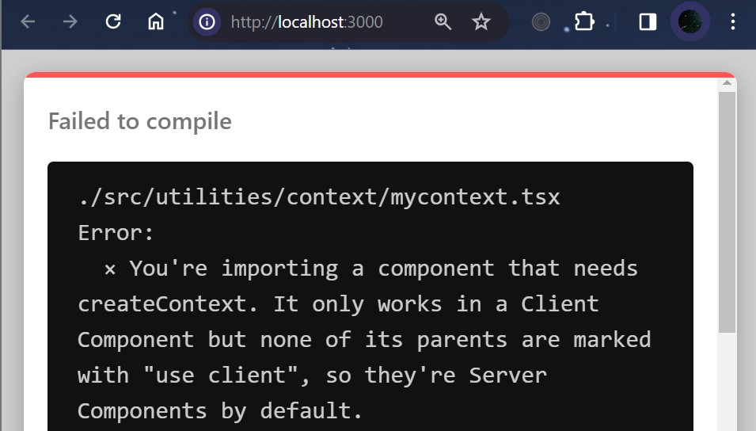

### Nama : Brian Mohamad Safiudin
### NIM : 2141720133
### Kelas : TI-3A
---

# Praktikum 1: Membuat Variasi Ukuran Teks Heading dengan Context

Pada praktikum ini, Anda akan mempelajari cara menggunakan `context` dengan diakses oleh komponen child didalamnya. `Context` memungkinkan sebuah komponen induk menyediakan data untuk seluruh pohon (tree) di bawahnya. Ada banyak kegunaan dari `context`

## Soal 1
#### Capture hasilnya dan buatlah laporan di README.md. Jelaskan apa yang telah Anda pelajari dan bagaimana tampilannya saat ini?



- `Membuat Struktur Folder dengan Prinsip Atomic Design`. Struktur folder dibuat dengan menggunakan prinsip desain atomik, yang membagi komponen menjadi level-level yang lebih kecil mulai dari atom, molekul, organisme, hingga template.

- `Membuat Komponen Atom`. Membuat komponen atom seperti Heading dan Section yang masing-masing bertanggung jawab untuk menampilkan judul dan bagian di halaman web.

- `Menggunakan Prop untuk Menentukan Ukuran Heading`. Komponen Heading menerima prop level yang digunakan untuk menentukan ukuran teks heading sesuai dengan level yang diberikan.

## Soal 2
#### Capture hasilnya dan buatlah laporan di README.md. Jelaskan apa yang telah Anda pelajari dan bagaimana tampilannya saat ini?
#### Jika terjadi error, silakan perbaiki, Mengapa hal itu bisa terjadi? Jelaskan!



- Error terjadi karena komponen yang diimpor membutuhkan `createContext` yang hanya bekerja pada `komponen klien`, namun belum ada parents yang menggunakan `use client`, sehingga `dianggap komponen server secara default`. Oleh karena itu, perlu ditambahkan `'use client';` pada file yang mengimpor komponen tersebut.

```tsx
'use client';

import MainPage from "@/components/templates/main_page";

export default function Home() {
    return <MainPage />;
}
```


- `useContext adalah sebuah Hook`. Sama seperti `useState` dan `useReducer`, hanya dapat memanggil sebuah Hook secara langsung di dalam komponen React (bukan di dalam pengulangan atau pengkondisian). useContext memberitahu React bahwa komponen `Heading` mau membaca `LevelContext`.

- Sekarang `komponen Heading tidak membutuhkan sebuah prop level`, tidak perlu mengoper level prop ke Heading. Sebagai gantinya Perbarui sehingga Section yang dapat menerimanya.

---
