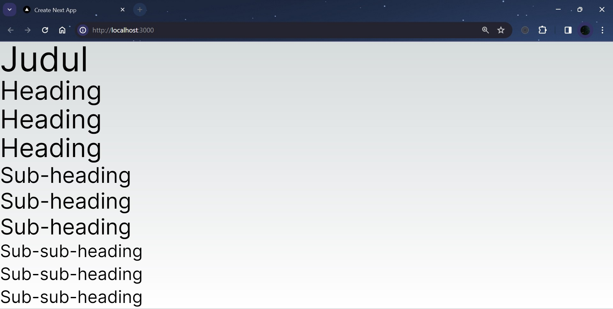
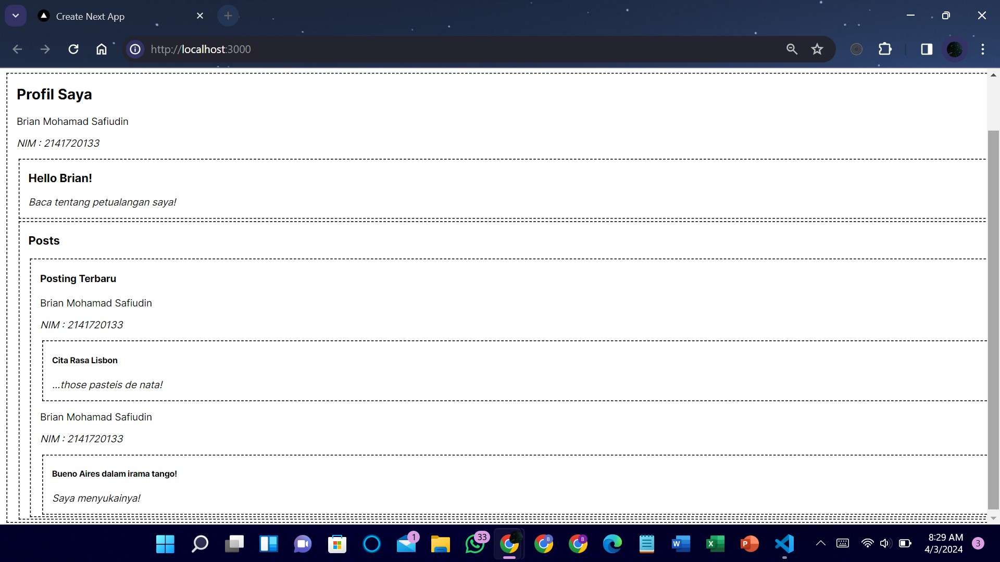
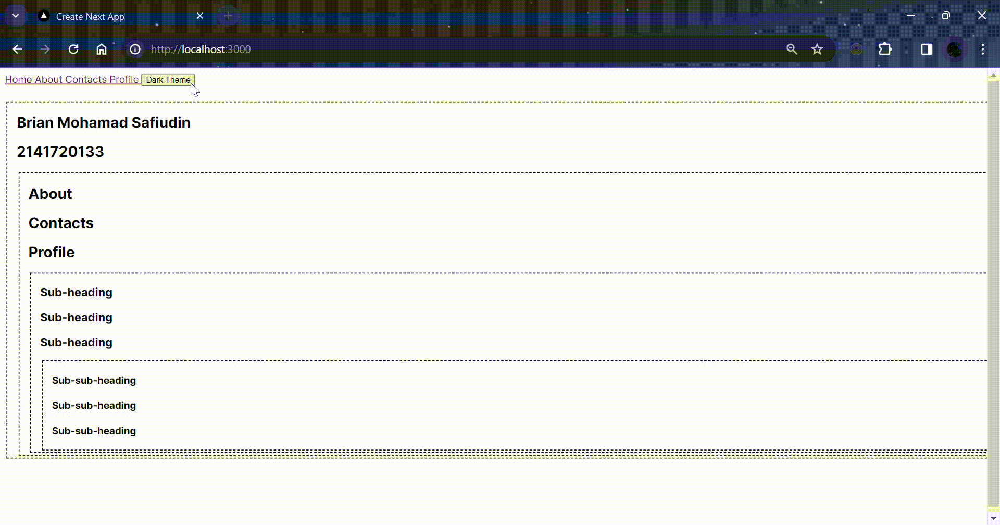

### Nama : Brian Mohamad Safiudin
### NIM : 2141720133
### Kelas : TI-3A
---

# Praktikum 1: Membuat Variasi Ukuran Teks Heading dengan Context

Pada praktikum ini, Anda akan mempelajari cara menggunakan `context` dengan diakses oleh komponen child didalamnya. `Context` memungkinkan sebuah komponen induk menyediakan data untuk seluruh pohon (tree) di bawahnya. Ada banyak kegunaan dari `context`

## Soal 1
#### Capture hasilnya dan buatlah laporan di README.md. Jelaskan apa yang telah Anda pelajari dan bagaimana tampilannya saat ini?


- `Membuat Struktur Folder dengan Prinsip Atomic Design`. Struktur folder dibuat dengan menggunakan prinsip desain atomik, yang membagi komponen menjadi level-level yang lebih kecil mulai dari atom, molekul, organisme, hingga template.

- `Membuat Komponen Atom`. Membuat komponen atom seperti Heading dan Section yang masing-masing bertanggung jawab untuk menampilkan judul dan bagian di halaman web.

- `Menggunakan Prop untuk Menentukan Ukuran Heading`. Komponen Heading menerima prop level yang digunakan untuk menentukan ukuran teks heading sesuai dengan level yang diberikan.

## Soal 2
#### Capture hasilnya dan buatlah laporan di README.md. Jelaskan apa yang telah Anda pelajari dan bagaimana tampilannya saat ini?
#### Jika terjadi error, silakan perbaiki, Mengapa hal itu bisa terjadi? Jelaskan!


- Error terjadi karena komponen yang diimpor membutuhkan `createContext` yang hanya bekerja pada `komponen klien`, namun belum ada parents yang menggunakan `use client`, sehingga `dianggap komponen server secara default`. Oleh karena itu, perlu ditambahkan `'use client';` pada file yang mengimpor komponen tersebut.

```tsx
'use client';

import MainPage from "@/components/templates/main_page";

export default function Home() {
    return <MainPage />;
}
```


- `useContext adalah sebuah Hook`. Sama seperti `useState` dan `useReducer`, hanya dapat memanggil sebuah Hook secara langsung di dalam komponen React (bukan di dalam pengulangan atau pengkondisian). useContext memberitahu React bahwa komponen `Heading` mau membaca `LevelContext`.

- Sekarang `komponen Heading tidak membutuhkan sebuah prop level`, tidak perlu mengoper level prop ke Heading. Sebagai gantinya Perbarui sehingga Section yang dapat menerimanya.

## Soal 3
#### Capture hasilnya dan buatlah laporan di README.md. Jelaskan apa yang telah Anda pelajari dan bagaimana tampilannya saat ini?



```tsx
import { LevelContext } from "@/utilities/context/mycontext";
import { useContext } from "react";

export default function Section({ children }: { children: any }) {
    const level = useContext(LevelContext);
    return (
        <section className={`section`}>
            <LevelContext.Provider value={level + 1}>
                {children}
            </LevelContext.Provider>
        </section>
    );
}
```

- `Menggunakan useContext untuk Membaca Context`. useContext adalah sebuah Hook yang memungkinkan Anda menggunakan nilai dari Context tanpa perlu menulis Consumer. useContext akan membaca nilai dari Context yang Anda berikan (dalam kasus ini, LevelContext).

- `Menggunakan Context untuk Menentukan Ukuran Heading`. Section menerima children dan menambahkan 1 ke level sebelumnya. Dengan demikian, semua Heading yang berada di dalam Section akan memiliki ukuran yang lebih besar dari Heading yang berada di luar Section.

---

# Praktikum 2: Membuat Context melewati komponen perantara

Pada praktikum ini, Anda dpat `menyisipkan sebanyak mungkin komponen` di antara komponen yang menyediakan `context` dan `komponen yang menggunakannya`. Ini termasuk komponen bawaan seperti `< div >` dan komponen yang mungkin Anda buat sendiri.

Komponen `Post` yang sama (dengan batas putus-putus) diberikan pada dua tingkat sarang yang berbeda. Perhatikan bahwa `< Heading >` di dalamnya mendapatkan level-nya secara otomatis dari `< Section >` terdekat.

## Soal 4
#### Capture hasilnya dan buatlah laporan di README.md. Tambahkan teks Nama dan NIM pada bagian komponen Post agar menunjukkan itu hasil kerja Anda!

```tsx
export default function Post({ title, body }: { title: string, body: string }) {
    return (
        <div>
            <p>Brian Mohamad Safiudin</p>
            <p><i>NIM : 2141720133</i></p>
            
            <Section2 isFancy={true}>
                <Heading>
                    {title}
                </Heading>
                <p><i>{body}</i></p>
            </Section2>
        </div>
    )
}
```



---

# Praktikum 3: Membuat Context Tema Light/Dark

Pada praktikum kali ini melanjutkan project dari praktikum sebelumnya, Anda akan membuat tema web yang bisa diubah menjadi mode light atau dark. Tampilan aplikasi web seperti berikut ini (Anda dapat berkreasi dengan konten dan style yang lain sesuai selera Anda).

## Soal 5
#### Silakan save semua dan lakukan running di browser Anda. Capture hasilnya dan buatlah laporan di README.md. Tambahkan teks Nama dan NIM pada setiap page routing agar menunjukkan itu hasil kerja Anda sendiri!

1. Apakah toggle button tema sudah berfungsi ? jika belum, silakan perbaiki!

- Tema sudah berfungsi dengan baik. `Ketika tombol toggle ditekan`, tema akan berubah dari light ke dark atau sebaliknya.



2. Mengapa ketika refresh atau berpindah halaman tema tidak permanen ? Buatlah menjadi permanen walaupun page sudah direfresh dan pindah halaman!

- Ketika halaman direfresh atau berpindah, tema tidak permanen karena `state tema tidak disimpan`. Untuk membuatnya permanen, dapat menggunakan `localStorage` untuk menyimpan state tema.
